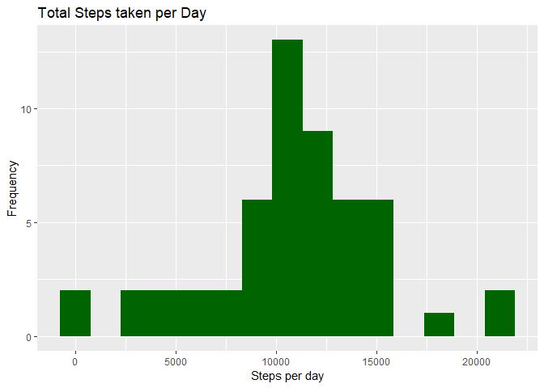
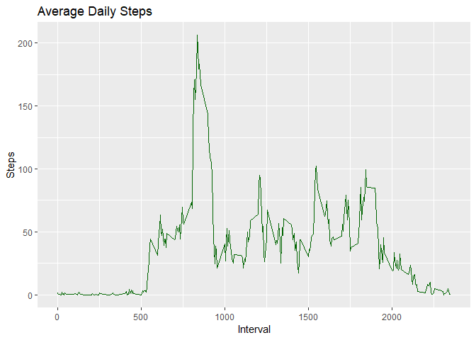
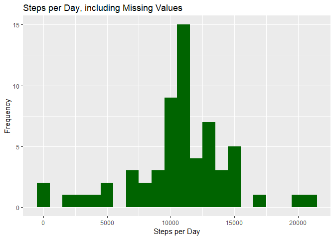
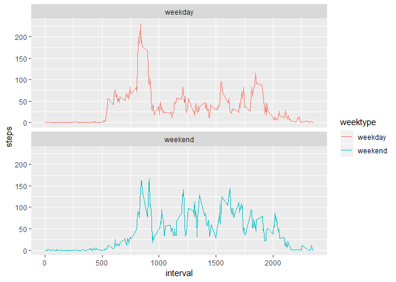

# LOADING AND PREPROCESSING OF DATA
## 1. Load the data
### In this section, we will be loading the data into the system. The loading of the dataset will be given an assumption that you have set a folder as your working directory as what I have done in this project. 

```r
data <- read.csv("activity.csv")
dim(data)
```

```
## [1] 17568     3
```

```r
head(data)
```

```
##   steps       date interval
## 1    NA 2012-10-01        0
## 2    NA 2012-10-01        5
## 3    NA 2012-10-01       10
## 4    NA 2012-10-01       15
## 5    NA 2012-10-01       20
## 6    NA 2012-10-01       25
```


## 2. Process/transform the data (if necessary) into a format suitable for your analysis
### After loading, we will set the data into a proper date format so that we can use it for plotting later on.

```r
data$date <- as.Date(data$date, "%Y-%m-%d")
dim(data)
```

```
## [1] 17568     3
```

```r
head(data)
```

```
##   steps       date interval
## 1    NA 2012-10-01        0
## 2    NA 2012-10-01        5
## 3    NA 2012-10-01       10
## 4    NA 2012-10-01       15
## 5    NA 2012-10-01       20
## 6    NA 2012-10-01       25
```

### We will also load the R packages that we will be needing in this project.

```r
library('dplyr')
library('ggplot2')
```


# WHAT IS MEAN TOTAL NUMBER OF STEPS TAKEN PER DAY?
## 1. Make a histogram of the total number of steps taken each day
### First, we will get the total sum of the steps taken per day and assign it to the data set.

```r
totalsteps <- aggregate(steps ~ date, data, sum )
dim(totalsteps)
```

```
## [1] 53  2
```

```r
head(totalsteps)
```

```
##         date steps
## 1 2012-10-02   126
## 2 2012-10-03 11352
## 3 2012-10-04 12116
## 4 2012-10-05 13294
## 5 2012-10-06 15420
## 6 2012-10-07 11015
```

### After geting the total sum of steps, we will be creating the histogram using the package gglot2

```r
ggplot(totalsteps, aes(x = steps)) +
  geom_histogram(fill = "darkgreen", bins = 15) +
  labs(title = "Total Steps taken per Day", x = "Steps per day", y = "Frequency")
```

<!-- -->


## 2. Calculate and report the mean and median total number of steps taken per day
### First, we will be getting the mean of the total steps that we got on the previous data set, excluding the null values.

```r
meansteps <- mean(data$steps, na.rm = TRUE)
meansteps
```

```
## [1] 37.3826
```

### Then, we will be getting the median of the total steps that we got on the previous data set, excluding the null values.

```r
mediansteps <- median(data$steps, na.rm = TRUE)
mediansteps
```

```
## [1] 0
```


# WHAT IS THE AVERAGE DAILY ACTIVITY PATTERN?
## 1. Make a time series plot (i.e. type = "l") of the 5-minute interval (x-axis) and the average number of steps taken, averaged across all days (y-axis)
### First is to create a dataset containing the average number of steps taken in a 5-minute interval with the null records removed using the package dplyr.

```r
intervalstep <- data %>%
  filter(!is.na(steps)) %>%
  group_by(interval) %>%
  summarize(steps = mean(steps))
dim(intervalstep)
```

```
## [1] 288   2
```

```r
head(intervalstep)
```

```
## # A tibble: 6 x 2
##   interval  steps
##      <int>  <dbl>
## 1        0 1.72  
## 2        5 0.340 
## 3       10 0.132 
## 4       15 0.151 
## 5       20 0.0755
## 6       25 2.09
```

### Then create a time series plot using the package ggplot2.

```r
ggplot(intervalstep, aes(x=interval, y=steps)) +
  geom_line(color = "darkgreen") +
  labs(title = "Average Daily Steps", x = "Interval", y = "Steps")
```

<!-- -->


## 2. Which 5-minute interval, on average across all the days in the dataset, contains the maximum number of steps?
### In this step, we will be getting the maxinum interval step that is provided in the data set.

```r
intervalstep$interval[which(intervalstep$steps == max(intervalstep$steps))]
```

```
## [1] 835
```


# INPUTTING MISSING VALUES
## 1. Calculate and report the total number of missing values in the dataset (i.e. the total number of rows with NAs)
### This code will get the total number of null values in the given data set.

```r
sum(is.na(data$steps))
```

```
## [1] 2304
```


## 2. Devise a strategy for filling in all of the missing values in the dataset. The strategy does not need to be sophisticated. For example, you could use the mean/median for that day, or the mean for that 5-minute interval, etc.
### The null values will be replaced by the mean of the data set.

```r
datafull <- data
nas <- is.na(datafull$steps)
avg_interval <- tapply(datafull$steps, datafull$interval, mean, na.rm=TRUE, simplify=TRUE)
datafull$steps[nas] <- avg_interval[as.character(datafull$interval[nas])]
dim(datafull)
```

```
## [1] 17568     3
```

```r
head(datafull)
```

```
##       steps       date interval
## 1 1.7169811 2012-10-01        0
## 2 0.3396226 2012-10-01        5
## 3 0.1320755 2012-10-01       10
## 4 0.1509434 2012-10-01       15
## 5 0.0754717 2012-10-01       20
## 6 2.0943396 2012-10-01       25
```


## 3. Create a new dataset that is equal to the original dataset but with the missing data filled in.
### The data set will be filled with the missing data needed from the data set done a while ago

```r
stepsfull <- datafull %>%
  filter(!is.na(steps)) %>%
  group_by(date) %>%
  summarize(steps = sum(steps)) %>%
  print
```

```
## # A tibble: 61 x 2
##    date        steps
##    <date>      <dbl>
##  1 2012-10-01 10766.
##  2 2012-10-02   126 
##  3 2012-10-03 11352 
##  4 2012-10-04 12116 
##  5 2012-10-05 13294 
##  6 2012-10-06 15420 
##  7 2012-10-07 11015 
##  8 2012-10-08 10766.
##  9 2012-10-09 12811 
## 10 2012-10-10  9900 
## # ... with 51 more rows
```

```r
dim(stepsfull)
```

```
## [1] 61  2
```

```r
head(stepsfull)
```

```
## # A tibble: 6 x 2
##   date        steps
##   <date>      <dbl>
## 1 2012-10-01 10766.
## 2 2012-10-02   126 
## 3 2012-10-03 11352 
## 4 2012-10-04 12116 
## 5 2012-10-05 13294 
## 6 2012-10-06 15420
```


## 4. Make a histogram of the total number of steps taken each day and Calculate and report the mean and median total number of steps taken per day. Do these values differ from the estimates from the first part of the assignment? What is the impact of imputing missing data on the estimates of the total daily number of steps?
### This code will generate a histogram of the needed data set

```r
ggplot(stepsfull, aes(x = steps)) +
    geom_histogram(fill = "darkgreen", binwidth = 1000) +
    labs(title = "Steps per Day, including Missing Values", x = "Steps per Day", y = "Frequency")
```

<!-- -->


# ARE THERE DIFFERENCES IN ACTIVITY PATTERNS BETWEEN WEEKDAYS AND WEEKENDS?
## 1. Create a new factor variable in the dataset with two levels -- "weekday" and "weekend" indicating whether a given date is a weekday or weekend day.
### This code will assign respective weekdays or weekend to the data set.

```r
  datafull <- mutate(datafull, weektype = ifelse(weekdays(datafull$date) == "Saturday" | weekdays(datafull$date) == "Sunday", "weekend", "weekday"))
  datafull$weektype <- as.factor(datafull$weektype)
  dim(datafull)
```

```
## [1] 17568     4
```

```r
  head(datafull)
```

```
##       steps       date interval weektype
## 1 1.7169811 2012-10-01        0  weekday
## 2 0.3396226 2012-10-01        5  weekday
## 3 0.1320755 2012-10-01       10  weekday
## 4 0.1509434 2012-10-01       15  weekday
## 5 0.0754717 2012-10-01       20  weekday
## 6 2.0943396 2012-10-01       25  weekday
```

## 2. Make a panel plot containing a time series plot (i.e. type = "l") of the 5-minute interval (x-axis) and the average number of steps taken, averaged across all weekday days or weekend days (y-axis). The plot should look something like the following, which was created using simulated data:
### First is for us to look for the average numbers of the interval

```r
intervalfull <- datafull %>%
    group_by(interval, weektype) %>%
    summarise(steps = mean(steps))
dim(intervalfull)
```

```
## [1] 576   3
```

```r
head(intervalfull)
```

```
## # A tibble: 6 x 3
## # Groups:   interval [3]
##   interval weektype  steps
##      <int> <fct>     <dbl>
## 1        0 weekday  2.25  
## 2        0 weekend  0.215 
## 3        5 weekday  0.445 
## 4        5 weekend  0.0425
## 5       10 weekday  0.173 
## 6       10 weekend  0.0165
```

### This code will create a time series plot of the data set that we have created a whole ago using the ggplot2

```r
s <- ggplot(intervalfull, aes(x=interval, y=steps, color = weektype)) +
    geom_line() +
    facet_wrap(~weektype, ncol = 1, nrow=2)
print(s)
```

<!-- -->
